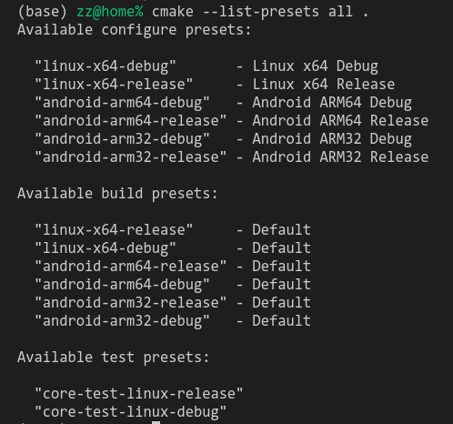

# 基于 CMakePresets.json 的跨平台 HelloWorld 工程

## CMakePresets.json 是什么？

微软和 Kitware 的开发者联合出了一个官方教程视频： [An Introduction to CMakePresets.json](https://www.youtube.com/watch?v=NFbnm1t6Mc4)

若无法访问视频， 可直接看官方给出的配套代码： https://github.com/esweet431/box2d-lite/blob/vs-launch/CMakePresets.json

按视频中说法， CMakePresets.json 可以提高“构建”、“编译”、“测试”的步骤的复用性, 主要用法为如下三个命令：

```bash
cmake --preset <configure-preset>
cmake --build --preset <build-preset>
ctest --preset <test-preset>
```

个人简单使用后理解为： 现在在 build 目录写的脚本如 linux-x64.sh, android-arm64.sh, android-arm32.sh 等， 它们之间有共性的部分可以提取出来（如：都使用 Ninja， 都是 Release 类型等）， 统一放到 CMakePresets.json 中进行描述和复用。

以下为详细操作步骤。


## 1. cmake 版本
```
cmake --version
```

使用 CMakePresets 的话， 需要 cmake >= 3.20, 因为 VS 里支持读取 CMakePreset.json 的功能是 3.20 开始加入的.

2022-05-02 我用的是 CMake 3.23。

## 2. 列出 Presets 文件
```
cmake --list-presets=all .
```


这一步会解析 CMakePresets.json 文件， 若提示报错如：
> CMake Error: Cound not read presets from d:/work/bla/bla: No "version" field
则需要修改 CMakePresets.json 增加 version 字段。

## 3. 执行 configure
在原有的编译命令基础上， 增加 `--preset <configurePresets数组中指定的preset>`，如：

```bash
cmake --preset linux-x64-release
```

**注意： 我们并没有指定它的路径， 假定了当前处于工程根目录， CMakePresets.json 也是放在根目录**

>(base) zz@home% cmake --preset linux-x64-release
>Preset CMake variables:
>
>  CMAKE_BUILD_TYPE="Release"
>  CMAKE_CXX_COMPILER="g++"
>  CMAKE_C_COMPILER="gcc"
>  CMAKE_INSTALL_PREFIX:PATH="/home/zz/work/test/presets-my/out/install/linux-x64-release"
>
>Preset environment variables:
>
>  VCPKG_FEATURE_FLAGS="manifests,versions,binarycaching,registries"
>
>-- Configuring done
>-- Generating done
>-- Build files have been written to: /home/zz/work/test/presets-my/out/build/linux-x64-release


## 4. 执行编译
在原有的编译命令基础上， 增加 `--preset <buildPresets数组中指定的preset>`，如：

```bash
cmake --build --preset linux-x64-release
```

## 5. 执行测试
在原有的测试命令基础上， 增加 `--preset <testPresets数组中指定的preset>`，如：

```bash
ctest --preset core-test-linux
```

## 6. 串联起来
我日常写跨平台的 C/C++， 即： 先在 PC（Linux x64 或 Windows x64）上开发， 然后在 Android ARM 平台部署测试。

将上述 configure， build， test 阶段执行的命令细节分别微调， 然后编写了 scripts 目录中的一些脚本：
- scritps/android-arm64.sh
- scripts/linux-x64.sh


## 7. 一些问题记录
- 如果 CMakePresets.json 里出错， 例如多写或少写`,`导致不符合语法， cmake 时不会报出具体错误， 给排查过程带来一定门槛
- CMakePresets.json 现在可以写注释（`//`开头）， 似乎曾经有一段时间不能写注释； 而 VSCode 的语法检查会提示报错， 可忽略； 能跑就行。