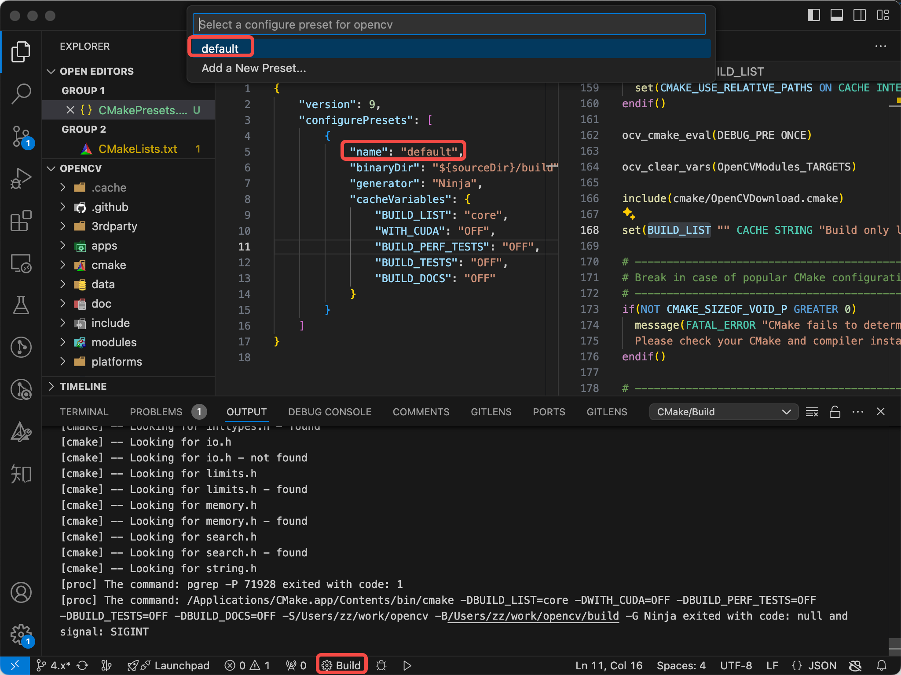

# Minimal build of OpenCV with CMakePresets.json

## Requirement

Consider this scenario: build OpenCV but with customizations:
- using Ninja as generator
- only build `opencv_core` module
- turn off unittests
- specify other cmake options, such as turn off OpenCL, etc

## Existing solutions

Specify a bunch of CMake Options or CMake Cache Variables in command line is too heavy. Existing solutions are:
- Paste full command in `.sh` script files
- Put options and cache variables with init values in `caches.cmake` script file and passing with `cmake -C caches.cmake`
- Put options cache variables with init values in `options.txt`, and cat the content of `options.txt` when build it, e.g. opencv-mobile (https://github.com/nihui/opencv-mobile/blob/master/.github/workflows/release.yml#L278-L279)

## Solve with CMakePresets.json

First, write up `CMakePresets.json`, and copy it to root directory of opencv source code:
```json
{
    "version": 9,
    "configurePresets": [
        {
            "name": "default",
            "binaryDir": "${sourceDir}/build",
            "generator": "Ninja",
            "cacheVariables": {
                "BUILD_LIST": "core",
                "WITH_CUDA": "OFF",
                "BUILD_PERF_TESTS": "OFF",
                "BUILD_TESTS": "OFF",
                "BUILD_DOCS": "OFF"
            }
        }
    ]
}
```

Then, invoke it in command line:
```bash
cmake --preset default
```

Or, in VSCode, simply click "build" button in bottom status bar and choose preset name:

