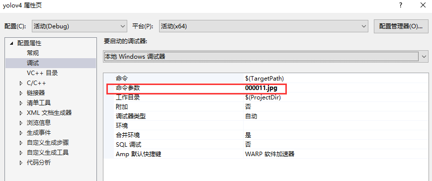

# ncnn cmake example

Demonstrates how to use ncnn in cmake by `find_package(ncnn)`


Inference library: [ncnn](https://github.com/Tencent/ncnn/), please compile it first, like:
```batch
:: extract ncnn-20200909.zip to e:/dev
cd e:/dev/ncnn-20200909
mkdir build
cd build
cmake .. -G "Visual Studio 15 2017 Win64" -DCMAKE_INSTALL_PREFIX=E:/lib/ncnn/20200909
cmake --build . --config Release --target ncnn
cmake --install .
```

Detection model: [yolo-fastest](https://github.com/dog-qiuqiu/Yolo-Fastest/tree/master/Yolo-Fastest)

Convert Tool: ncnn's self contained (compiled by hand) `darknet2ncnn.exe`

**Remember** to specify command line arguments (e.g. Visual Studio, project's properties->General properties->Debug->command line arguments):


